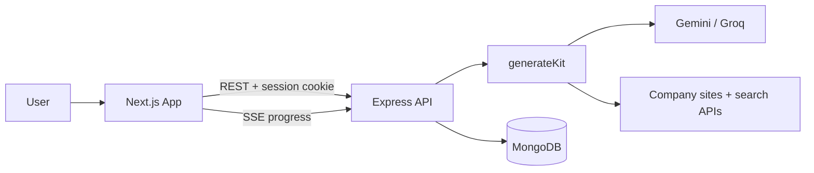

# AI Interview Prep Kit — Frontend

Next.js UI for the Trao full-stack assessment.

**App:** https://trao.malviya.xyz/ · **API:** https://api-trao.malviya.xyz · **Repo:** https://github.com/Atmalviya/trao-frontend

Pipeline, architecture, and batch CLI → **[backend README](https://github.com/Atmalviya/trao-backend/blob/main/README.md)**

---

## Architecture



Pipeline architecture + sequence diagrams → **[backend README](https://github.com/Atmalviya/trao-backend#architecture)**

**Stack:** Next.js 15 · Tailwind CSS 4 · TanStack Query · @dnd-kit

---

## Setup

**Local**

```bash
npm install && cp .env.example .env.local && npm run dev
```

```env
NEXT_PUBLIC_API_URL=http://localhost:4000
```

Backend needs `WEB_ORIGIN=http://localhost:3000`.

**Deployed (Vercel)**

```env
NEXT_PUBLIC_API_URL=https://api-trao.malviya.cloud
```

Redeploy after changing. Backend needs `WEB_ORIGIN=https://www.trao.malviya.cloud` and `NODE_ENV=production`. No trailing slashes.

---

## Scripts

`npm run dev` · `npm run build` · `npm start` · `npm run lint`
